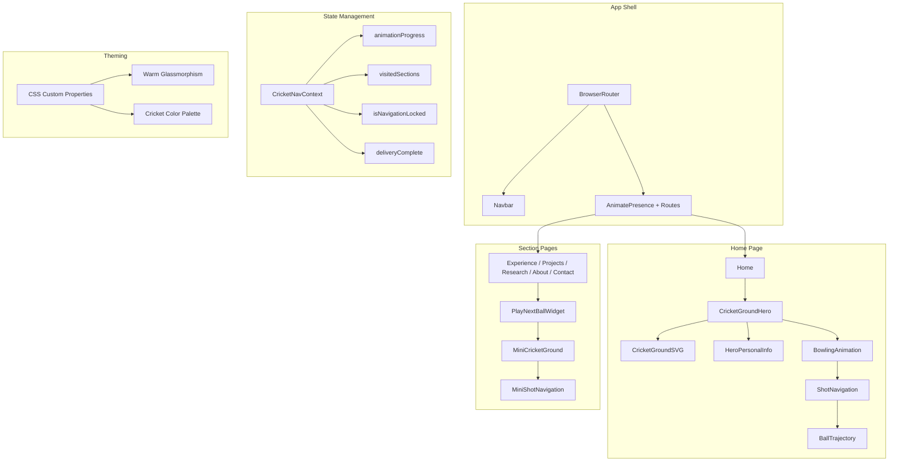

# Design Document: Cricket Theme Redesign

## Overview

This design transforms the existing React + Vite portfolio from a cool-toned dark glassmorphism aesthetic into an immersive cricket evening-match experience. The redesign introduces a full-viewport SVG cricket ground as the hero section, scroll-triggered bowling animations using Framer Motion's scroll hooks, shot-based navigation with bezier ball trajectories, and a warm glassmorphism card system — all while preserving the existing data layer, routing configuration, and tech stack.

The architecture follows a layered approach:
1. **Theming Layer** — CSS custom properties and warm glassmorphism styles applied globally
2. **SVG Illustration Layer** — Inline SVG cricket ground with composable sub-layers
3. **Animation Layer** — Framer Motion scroll-linked transforms driving bowling and ball trajectory animations
4. **Navigation Layer** — Dual-mode system combining professional Top_Navbar with cricket Shot_Navigation and Play_Next_Ball_Widget
5. **State Layer** — React context managing animation progress, visited sections, and navigation locking

## Architecture



### Key Architectural Decisions

1. **Inline SVG over external SVG files** — Enables direct Framer Motion animation control over individual elements (bowler position, ball position, field markers). External SVGs would require additional loading and lose animation binding.

2. **useScroll + useTransform over IntersectionObserver** — Framer Motion's scroll hooks provide smooth, frame-synced progress values ideal for multi-phase animation. IntersectionObserver only gives binary visibility states.

3. **React Context for navigation state** — Animation progress, visited sections, and navigation locking are shared across CricketGroundHero, ShotNavigation, BallTrajectory, and PlayNextBallWidget. Context avoids prop-drilling across 4+ levels.

4. **CSS custom properties for theming** — Single source of truth for the cricket color palette, enabling a clean migration from the current cool-toned variables without touching component internals.

5. **Session-based visited tracking via sessionStorage** — The Play_Next_Ball_Widget needs to know which sections have been visited during the current browser session. sessionStorage provides persistence across route changes without needing a backend.

## Components and Interfaces

### New Components

| Component | Location | Responsibility |
|-----------|----------|----------------|
| `CricketGroundHero` | `src/components/cricket/CricketGroundHero.jsx` | Orchestrates the full hero section: SVG ground, personal info overlay, bowling animation, shot navigation |
| `CricketGroundSVG` | `src/components/cricket/CricketGroundSVG.jsx` | Pure inline SVG rendering the top-down cricket field (outfield, boundary, 30-yard circle, pitch, crease lines) |
| `BowlingAnimation` | `src/components/cricket/BowlingAnimation.jsx` | Scroll-linked animation of bowler run-up, delivery stride, and ball release using useScroll/useTransform |
| `ShotNavigation` | `src/components/cricket/ShotNavigation.jsx` | Renders 5 clickable shot targets positioned at field locations, handles keyboard navigation |
| `BallTrajectory` | `src/components/cricket/BallTrajectory.jsx` | Animates ball along a bezier curve from batsman to selected shot target, triggers navigation on completion |
| `PlayNextBallWidget` | `src/components/cricket/PlayNextBallWidget.jsx` | Fixed-position mini cricket ground overlay on section pages with shot options for unvisited sections |
| `SilhouetteBowler` | `src/components/cricket/SilhouetteBowler.jsx` | Geometric SVG silhouette of a left-arm bowler composed of circles, rectangles, triangles |
| `SilhouetteBatsman` | `src/components/cricket/SilhouetteBatsman.jsx` | Geometric SVG silhouette of a right-handed batsman |
| `CricketNavProvider` | `src/context/CricketNavContext.jsx` | React Context provider managing animation progress, visited sections, navigation lock state |

### Modified Components

| Component | Changes |
|-----------|---------|
| `Home.jsx` | Replace current hero section and home-container with CricketGroundHero; retain below-fold sections (Currently, CompanyLogoStrip, ProjectShowcase, SkillMarquee, ExperiencePreview, BeyondCode, CTA) |
| `Navbar.jsx` | Update color references from teal/lime to cricket palette (gold highlights, warm borders); retain all navigation labels and routing logic |
| `GlassCard.jsx` | Replace cool-toned border/bg classes with warm glassmorphism CSS classes |
| `index.css` | Replace `:root` CSS custom properties with Cricket_Color_Palette; update `#root` background gradient; update `.glass`, `.glass-hover` classes |
| `App.jsx` | Wrap with `CricketNavProvider`; no routing changes |
| Section pages (Experience, Projects, Research, About, Contact) | Add PlayNextBallWidget at bottom of content area |

### Component Interfaces

```typescript
// CricketGroundSVG Props
interface CricketGroundSVGProps {
  width?: string;        // default "100%"
  height?: string;       // default "100%"
  className?: string;
  showCreaseLines?: boolean;  // default true
  show30YardCircle?: boolean; // default true
  compact?: boolean;     // true for mini version in PlayNextBallWidget
}

// BowlingAnimation Props
interface BowlingAnimationProps {
  scrollProgress: MotionValue<number>;  // from useScroll
  onDeliveryComplete: () => void;
}

// ShotNavigation Props
interface ShotNavigationProps {
  visible: boolean;
  shots: ShotTarget[];
  onShotSelect: (shot: ShotTarget) => void;
  compact?: boolean;  // true inside PlayNextBallWidget
}

// ShotTarget type
interface ShotTarget {
  id: string;
  label: string;
  subLabel?: string;         // e.g., "Caught your attention?" for contact
  path: string;              // React Router path
  position: { x: number; y: number };  // relative to batsman origin (%)
  ariaLabel: string;
}

// BallTrajectory Props
interface BallTrajectoryProps {
  from: { x: number; y: number };
  to: { x: number; y: number };
  onComplete: () => void;
  duration?: number;  // 600-1000ms
}

// PlayNextBallWidget Props
interface PlayNextBallWidgetProps {
  currentPath: string;
}

// CricketNavContext shape
interface CricketNavContextValue {
  animationProgress: number;
  deliveryComplete: boolean;
  visitedSections: Set<string>;
  isNavigationLocked: boolean;
  markSectionVisited: (path: string) => void;
  lockNavigation: () => void;
  unlockNavigation: () => void;
}
```

## Data Models

### Shot Configuration (static)

```javascript
// src/config/shotNavigation.js
export const SHOT_TARGETS = [
  {
    id: 'cover-drive',
    label: 'Cover Drive',
    path: '/experience',
    position: { x: 72, y: 28 },   // off-side, forward of square
    bezierControl: { cx1: 55, cy1: 42, cx2: 68, cy2: 32 },
    ariaLabel: 'Navigate to Experience section via Cover drive',
  },
  {
    id: 'pull-shot',
    label: 'Pull Shot',
    path: '/projects',
    position: { x: 22, y: 30 },   // square leg
    bezierControl: { cx1: 40, cy1: 45, cx2: 28, cy2: 35 },
    ariaLabel: 'Navigate to Projects section via Pull shot',
  },
  {
    id: 'straight-drive',
    label: 'Straight Drive',
    path: '/research',
    position: { x: 50, y: 10 },   // down the ground
    bezierControl: { cx1: 50, cy1: 38, cx2: 50, cy2: 20 },
    ariaLabel: 'Navigate to Research section via Straight drive',
  },
  {
    id: 'flick',
    label: 'Flick',
    path: '/about',
    position: { x: 18, y: 60 },   // fine leg
    bezierControl: { cx1: 38, cy1: 52, cx2: 24, cy2: 58 },
    ariaLabel: 'Navigate to About section via Flick',
  },
  {
    id: 'caught-at-slip',
    label: 'Caught at Slip',
    subLabel: 'Caught your attention?',
    path: '/contact',
    position: { x: 78, y: 62 },   // slip region
    bezierControl: { cx1: 58, cy1: 55, cx2: 72, cy2: 60 },
    ariaLabel: 'Navigate to Contact section via Caught at slip',
  },
];
```

### Animation Phase Configuration

```javascript
// src/config/animationPhases.js
export const BOWLING_PHASES = {
  RUNUP: { start: 0, end: 0.4 },
  DELIVERY_STRIDE: { start: 0.4, end: 0.7 },
  BALL_RELEASE: { start: 0.7, end: 1.0 },
};

export const BALL_TRAJECTORY_CONFIG = {
  duration: { min: 600, max: 1000 },  // ms
  easing: [0.4, 0, 0.2, 1],           // cubic-bezier
  ballDiameter: { min: 12, max: 24 }, // px
  ballColor: '#8b1a1a',               // Cricket Red
};

export const MOBILE_CONFIG = {
  breakpoint: 768,
  maxScrollDistance: '50vh',
  widgetSize: 64,        // px
  minTouchTarget: 44,    // px
};
```

### Cricket Color Palette (CSS Custom Properties)

```css
:root {
  --bg: #0d1f0d;              /* Deep Green */
  --bg-deep: #0a2e2a;         /* Dark Teal */
  --accent-orange: #e8760a;   /* Warm Orange */
  --accent-red: #8b1a1a;      /* Cricket Red */
  --accent-gold: #c9a227;     /* Gold */
  --text: #f5f0e8;            /* Cream */
  --text-soft: #a8b5a0;       /* Sage */

  /* Warm Glassmorphism tokens */
  --glass-border: rgba(200, 180, 140, 0.15);
  --glass-bg: rgba(13, 31, 13, 0.72);
  --glass-blur: 12px;
  --glass-card-bg: rgba(30, 25, 18, 0.40);
  --glass-card-blur: 18px;
  --glass-hover-border: rgba(201, 162, 39, 0.45);

  /* Background gradient */
  --root-gradient:
    radial-gradient(900px 600px at 8% 5%, rgba(13, 31, 13, 0.35), transparent 65%),
    radial-gradient(700px 500px at 88% 10%, rgba(10, 46, 42, 0.25), transparent 65%),
    radial-gradient(700px 600px at 78% 78%, rgba(139, 26, 26, 0.08), transparent 68%),
    linear-gradient(145deg, #0d1f0d 0%, #0a2e2a 46%, #0d1f0d 100%);
}
```

### Navigation State (Context + sessionStorage)

```javascript
// Initial state shape
const initialState = {
  animationProgress: 0,        // 0..1 from useScroll
  deliveryComplete: false,     // true when scroll progress >= 1.0
  visitedSections: new Set(),  // populated from sessionStorage on mount
  isNavigationLocked: false,   // true during BallTrajectory animation
};
```

### SVG Cricket Ground Layer Structure

```
CricketGroundSVG
├── <ellipse> outfield (green fill)
├── <ellipse> boundary rope (stroke, slightly inside outfield edge)
├── <circle> 30-yard circle (dashed stroke)
├── <rect> pitch strip (lighter green/tan)
├── <line> popping crease (white stroke)
├── <line> bowling crease (white stroke)
├── <line> return crease x2 (white stroke)
└── [aria-hidden] decorative marks
```


## Correctness Properties

*A property is a characteristic or behavior that should hold true across all valid executions of a system — essentially, a formal statement about what the system should do. Properties serve as the bridge between human-readable specifications and machine-verifiable correctness guarantees.*

### Property 1: Scroll progress maps to correct animation phase

*For any* scroll progress value in the range [0, 1], the phase mapping function SHALL return "runup" for values in [0, 0.4), "delivery_stride" for values in [0.4, 0.7), and "ball_release" for values in [0.7, 1.0], and the mapping SHALL be monotonic (increasing progress never returns to an earlier phase).

**Validates: Requirements 2.3, 8.2**

### Property 2: Shot activation completes navigation and moves focus

*For any* shot target in SHOT_TARGETS, when the target is activated (via click, Enter, or Space) and the ball trajectory animation completes, the system SHALL navigate to the target's configured path AND move document focus to the destination section's heading element.

**Validates: Requirements 3.4, 9.6**

### Property 3: Navigation locking prevents concurrent trajectories

*For any* sequence of shot target activations where the first triggers a ball trajectory animation, all subsequent activations received before the first animation completes SHALL be ignored, resulting in exactly one navigation event.

**Validates: Requirements 3.6**

### Property 4: Keyboard activation produces identical behavior to pointer activation

*For any* shot target, activating it via Enter key or Space key while focused SHALL trigger the same ball trajectory animation and navigation as a pointer click, with no difference in trajectory path, duration, or destination.

**Validates: Requirements 3.7**

### Property 5: Visited sections filtering in PlayNextBallWidget

*For any* subset of visited section paths (from the set {/experience, /projects, /research, /about, /contact}), the PlayNextBallWidget SHALL display shot targets for exactly (allSections - visitedSections) when the visited set is a proper subset, and SHALL display targets for ALL sections when visitedSections equals the full set.

**Validates: Requirements 4.2, 4.3, 4.4**

### Property 6: Cricket color palette compliance

*For any* CSS color value or inline style color reference in the rendered application, the value SHALL resolve to one of the defined Cricket_Color_Palette custom properties or their computed values, with no hardcoded hex, rgb, or hsl values outside the palette.

**Validates: Requirements 5.2, 5.4**

### Property 7: WCAG contrast ratio compliance

*For any* text-background color pair used in the application where text is at or below 18px (or 14px bold), the WCAG 2.1 luminance contrast ratio SHALL be at least 4.5:1; and for text larger than 18px (or 14px bold), the ratio SHALL be at least 3:1. Specifically, Cream (#f5f0e8) against Deep Green (#0d1f0d) and Sage (#a8b5a0) against Deep Green (#0d1f0d) SHALL each meet these thresholds.

**Validates: Requirements 5.6, 9.5**

### Property 8: Reduced motion disables scroll-triggered animations

*For any* scroll position and any animation state, when the user has `prefers-reduced-motion: reduce` enabled, the Bowling_Animation SHALL not play, and the Shot_Navigation targets SHALL be visible and interactive on page load without requiring any scroll interaction.

**Validates: Requirements 8.6**

### Property 9: Aria-labels contain destination and shot name

*For any* shot target rendered in ShotNavigation or PlayNextBallWidget, the element's aria-label attribute SHALL contain both the destination section name (e.g., "Experience") and the associated cricket shot name (e.g., "Cover drive").

**Validates: Requirements 9.1**

## Error Handling

### Component Failure Isolation

| Failure Scenario | Behavior | Fallback |
|-----------------|----------|----------|
| CricketGroundSVG fails to render | ErrorBoundary catches, hides hero SVG | Top_Navbar remains sole navigation; hero section shows personal info without SVG background |
| BowlingAnimation throws during scroll | ErrorBoundary catches animation container | ShotNavigation displayed immediately (same as reduced-motion mode) |
| BallTrajectory animation fails | onComplete fires immediately (skip animation) | Navigation proceeds directly via React Router |
| PlayNextBallWidget fails | ErrorBoundary hides widget | Top_Navbar provides complete navigation |
| sessionStorage unavailable | visitedSections defaults to empty Set | Widget shows all section targets (degrades to "show all" mode) |
| Invalid shot target configuration | Filter out malformed targets | Only valid targets render; console.warn in development |

### Error Boundary Strategy

```
App
├── Navbar (outside any cricket ErrorBoundary — always renders)
├── CricketErrorBoundary
│   └── CricketGroundHero
│       ├── CricketGroundSVG
│       ├── BowlingAnimation
│       ├── ShotNavigation
│       └── BallTrajectory
└── PageContent
    └── CricketErrorBoundary
        └── PlayNextBallWidget
```

A dedicated `CricketErrorBoundary` wraps all cricket-themed components separately from the Navbar and page content. If any cricket component throws:
1. The boundary renders a null fallback (invisible)
2. The Navbar continues operating normally
3. If on Home page, personal info text remains visible via a separate non-SVG container that renders outside the error boundary

### Navigation Lock Safety

- A 1200ms timeout on `isNavigationLocked` ensures the lock auto-releases if BallTrajectory fails to fire `onComplete`
- This prevents permanent navigation deadlock from animation errors

### sessionStorage Handling

```javascript
function getVisitedSections() {
  try {
    const stored = sessionStorage.getItem('cricket-visited');
    return stored ? new Set(JSON.parse(stored)) : new Set();
  } catch {
    return new Set(); // graceful degradation
  }
}

function saveVisitedSections(sections) {
  try {
    sessionStorage.setItem('cricket-visited', JSON.stringify([...sections]));
  } catch {
    // silently fail — feature degrades to "show all"
  }
}
```

## Testing Strategy

### Dual Testing Approach

This feature is suitable for property-based testing because:
- The phase mapping function is pure with clear input/output (scroll progress → phase)
- The visited sections filter is a pure set operation with many possible input combinations
- Contrast ratio computation is a pure mathematical function
- Aria-label validation is a universal structural property across all targets
- Navigation locking is an invariant that must hold across all possible click sequences

### Property-Based Tests (fast-check)

The project already uses `fast-check` (v4.9.0) for property testing. Each property test will run a minimum of 100 iterations.

| Property | Test File | Generator Strategy |
|----------|-----------|-------------------|
| P1: Phase mapping | `src/__tests__/properties/phase-mapping.property.test.js` | Generate floats in [0, 1] |
| P2: Navigation + focus | `src/__tests__/properties/shot-navigation.property.test.jsx` | Generate from SHOT_TARGETS array, activation method (click/Enter/Space) |
| P3: Navigation locking | `src/__tests__/properties/navigation-locking.property.test.jsx` | Generate pairs of shot targets and timing offsets |
| P4: Keyboard parity | `src/__tests__/properties/keyboard-activation.property.test.jsx` | Generate shot targets × activation keys |
| P5: Visited filtering | `src/__tests__/properties/visited-sections.property.test.js` | Generate subsets of section paths via `fc.subarray` |
| P6: Palette compliance | `src/__tests__/properties/color-palette.property.test.js` | Static analysis of rendered CSS — enumerate all color declarations |
| P7: Contrast ratios | `src/__tests__/properties/contrast-ratio.property.test.js` | Generate pairs from palette colors, compute WCAG ratio |
| P8: Reduced motion | `src/__tests__/properties/reduced-motion.property.test.jsx` | Generate scroll positions with reduced-motion mock enabled |
| P9: Aria-labels | `src/__tests__/properties/aria-labels.property.test.jsx` | Generate from SHOT_TARGETS, verify label structure |

Each test will be tagged with:
```javascript
// Feature: cricket-theme-redesign, Property 1: Scroll progress maps to correct animation phase
```

### Unit Tests (Example-Based)

| Test Area | Coverage |
|-----------|----------|
| CricketGroundSVG structure | Verifies required SVG elements (outfield, boundary, crease, 30-yard circle) |
| HeroPersonalInfo rendering | Verifies name, photo, description from personalData |
| ShotNavigation Contact label | Verifies "Caught your attention?" sub-label |
| Warm glassmorphism values | Verifies border/bg/blur CSS values on GlassCard |
| Route preservation | Verifies all 7 routes still render |
| Navbar labels | Verifies professional labels on all pages |
| Ball diameter bounds | Verifies ball SVG circle radius within [6, 12] |

### Integration Tests

| Test Area | Coverage |
|-----------|----------|
| Scroll → animation → navigation flow | End-to-end scroll triggering delivery, shot click, trajectory, page navigation |
| PlayNextBallWidget lifecycle | Click button → widget appears → shot targets → navigation |
| Mobile viewport behavior | Shot targets visible on load at <768px |
| Error boundary isolation | Cricket component failure doesn't break Navbar |

### Accessibility Tests

- axe-core automated audit on all pages with new cricket components
- Keyboard navigation flow through all shot targets
- Screen reader announcement verification after navigation (focus management)
- prefers-reduced-motion behavior validation

### Test Configuration

```javascript
// vitest.config.js additions
{
  test: {
    // Property tests need more time due to 100+ iterations
    testTimeout: 15000,
  }
}
```
