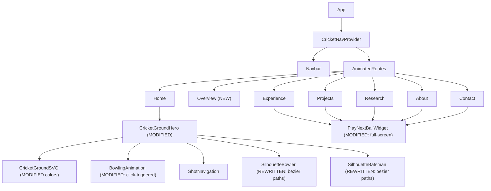
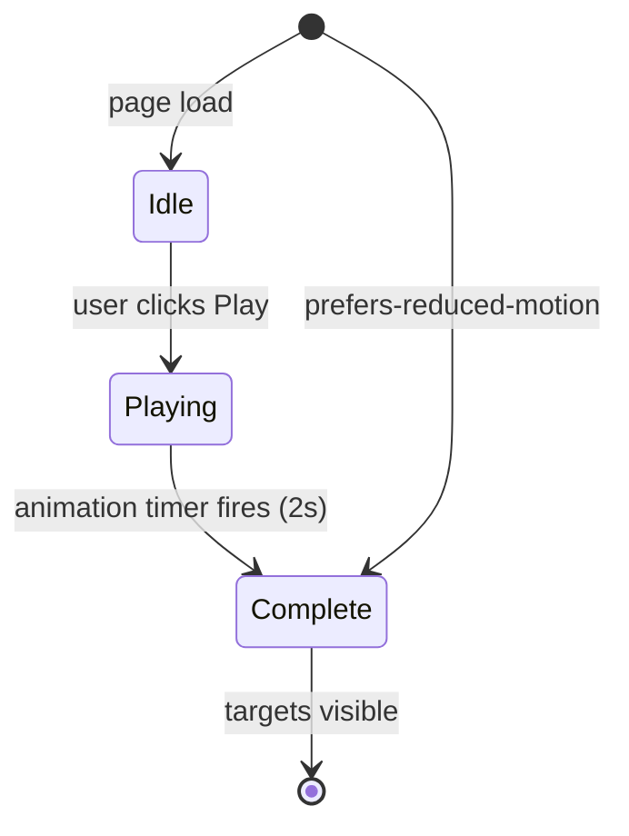

# Design Document: Cricket Visual Overhaul

## Overview

This design covers a comprehensive visual and interaction overhaul of the existing cricket-themed portfolio. The changes are purely presentational and structural — the data layer, state management (CricketNavContext), and routing architecture remain intact.

**Core changes:**
1. **Color palette swap** — dark olive/teal → vibrant pitch green + sunset sky gradient
2. **SVG figure upgrade** — geometric shapes → bezier-path professional silhouettes
3. **PlayNextBallWidget → full-screen takeover** — 280-320px corner widget → 100vw×100vh cinematic overlay
4. **Home page restructure** — scroll-linked animation removed, home locked to 100vh, below-fold content moved to `/overview` route accessed via a 6th shot target

**What stays the same:**
- CricketNavContext (visitedSections, navigation locking, markSectionVisited)
- SHOT_TARGETS config shape (id, label, path, position, bezierControl, ariaLabel)
- BallTrajectory component interface
- ShotNavigation component interface
- React Router route structure (except adding `/overview`)
- AnimatePresence page transitions
- All data.js imports

---

## Architecture

### High-Level Component Hierarchy (unchanged structure, modified internals)



### Change Classification

| Component | Change Type | Scope |
|-----------|-------------|-------|
| `src/styles/index.css` | MODIFIED | CSS custom properties, gradient, glass tokens |
| `src/components/cricket/SilhouetteBowler.jsx` | REWRITTEN | Full SVG rewrite with bezier paths |
| `src/components/cricket/SilhouetteBatsman.jsx` | REWRITTEN | Full SVG rewrite with bezier paths |
| `src/components/cricket/PlayNextBallWidget.jsx` | MODIFIED | Small overlay → full-screen takeover |
| `src/components/cricket/CricketGroundHero.jsx` | MODIFIED | Remove scroll-linking, add click trigger, add 6th target |
| `src/components/cricket/CricketGroundSVG.jsx` | MODIFIED | Update fill colors |
| `src/components/cricket/BowlingAnimation.jsx` | MODIFIED | Support click-triggered timed mode |
| `src/config/shotNavigation.js` | MODIFIED | Add 6th "Overview" target |
| `src/pages/Home.jsx` | MODIFIED | Remove below-fold sections, lock to 100vh |
| `src/pages/Overview.jsx` | NEW | New page with relocated below-fold content |
| `src/App.jsx` | MODIFIED | Add `/overview` route |

---

## Components and Interfaces

### 1. CSS Custom Properties (`src/styles/index.css`)

**Changes to `:root`:**

```css
:root {
  /* Cricket Color Palette V2 — Evening Stadium */
  --pitch-green: #1a5c2e;         /* Vibrant pitch green (hsl ~145°, 55%, 23%) */
  --bg: var(--pitch-green);
  --bg-deep: #12461f;             /* Deeper shade (same hue, ~5-8% darker) */
  --floodlight-amber: #e8a020;    /* Warm stadium floodlight (hue ~40°, sat 85%, light 52%) */
  --sky-purple: #1a1040;          /* Upper sky (hue ~255°, lightness ~15%) */
  --sky-pink: #5c2040;            /* Mid-sky dusky pink (hue ~335°, lightness ~24%) */
  --accent-orange: var(--floodlight-amber); /* Alias for compatibility */
  
  /* Sunset Sky Gradient (applied to #root) */
  --sunset-gradient: linear-gradient(
    to top,
    hsl(40, 75%, 22%) 0%,
    hsl(25, 70%, 25%) 30%,
    hsl(335, 45%, 20%) 60%,
    hsl(255, 50%, 12%) 100%
  );

  /* Updated Glassmorphism tokens */
  --glass-border: rgba(232, 160, 32, 0.15);       /* floodlight-amber @ 0.15 alpha */
  --glass-bg: rgba(26, 92, 46, 0.72);             /* pitch-green @ 0.72 alpha */
  --glass-card-bg: rgba(26, 92, 46, 0.40);        /* pitch-green @ 0.40 alpha */
  --glass-hover-border: rgba(232, 160, 32, 0.45); /* floodlight-amber @ 0.45 alpha */
}
```

**`#root` background replacement:**
```css
#root {
  background: var(--sunset-gradient);
}
```

**`::selection` update:**
```css
::selection {
  background: rgba(232, 160, 32, 0.30); /* floodlight-amber @ 0.30 */
}
```

### 2. SilhouetteBowler (REWRITTEN)

**Interface preserved:**
```typescript
// Props remain identical — BowlingAnimation drives these
interface SilhouetteBowlerProps {
  x?: MotionValue<number> | number;
  y?: MotionValue<number> | number;
  rotate?: MotionValue<number> | number;
  scale?: number;
  fill?: string;
  className?: string;
}
```

**Implementation change:**
- Remove all `<circle>`, `<rect>`, `<polygon>` elements
- Replace with 5-8 `<path>` elements using cubic bezier (C/c) commands
- Figure depicts fast bowling delivery action: bowling arm extended above head, front leg braced, back leg trailing, side-on shoulder alignment
- Cricket-specific silhouette detail: trouser leg shapes, hand at bowling arm terminus, front-arm counterbalance
- Bounding box: ≤40 units wide × ≤60 units tall at scale=1 within the 200×120 viewBox
- Single solid fill, no gradients or interior lines

### 3. SilhouetteBatsman (REWRITTEN)

**Interface preserved:**
```typescript
// Props remain identical — CricketGroundHero positions this
interface SilhouetteBatsmanProps {
  className?: string;
  style?: React.CSSProperties;
  [key: string]: any; // spread props
}
```

**Implementation change:**
- Remove all `<circle>`, `<rect>` elements
- Replace with 5+ `<path>` elements using cubic bezier (C/c) commands
- Figure depicts batting stance: bat at 35°-55° backlift, knees bent (front knee 120°-160°), head over front knee
- Cricket-specific equipment in silhouette: bat blade (10-12% of figure height), batting pads (knee to ankle), helmet with grille/peak
- Single solid fill, no gradients

### 4. CricketGroundSVG (MODIFIED)

**Color changes only:**
```diff
- fill="#1a3d1a"  (outfield)
+ fill="#2d8a4e"  (vibrant grass green, sat >50%, lightness 30-50%)

- fill="#3d6b3d"  (pitch strip)  
+ fill="#7ab87a"  (lighter, slightly yellowed, +10% lightness over outfield)
```

### 5. CricketGroundHero (MODIFIED)

**Key changes:**
- Remove `useScroll` / scroll progress tracking
- Remove 300vh/150vh height — set to exactly `100vh`
- Add a "Play" button that triggers a timed bowling animation (1.5-2.5s)
- After timed animation completes, show ShotNavigation (including 6th Overview target)
- When `prefers-reduced-motion` is enabled: show all targets immediately on load, no play button needed
- Remove personal info overlay positioning that assumed scroll context

**New state:**
```javascript
const [animationState, setAnimationState] = useState('idle'); 
// 'idle' | 'playing' | 'complete'
```

**Animation trigger:**
```javascript
const handlePlay = () => {
  setAnimationState('playing');
  // BowlingAnimation runs on a 2s timer, then calls onDeliveryComplete
};
```

### 6. BowlingAnimation (MODIFIED)

**New prop: `mode`**
```typescript
interface BowlingAnimationProps {
  scrollProgress?: MotionValue<number>;  // Still used in PlayNextBallWidget context
  onDeliveryComplete: () => void;
  mobile?: boolean;
  mode?: 'scroll' | 'timed';  // NEW — 'timed' for Home page click-trigger
  timedDuration?: number;      // NEW — duration in ms (default 2000)
}
```

When `mode='timed'`:
- Internally creates a MotionValue and animates it from 0→1 over `timedDuration` ms
- Uses the same useTransform mappings for bowler position
- Calls `onDeliveryComplete` at progress=1.0

### 7. PlayNextBallWidget (MODIFIED → Full-Screen Takeover)

**Key changes:**
- Overlay changes from 280-320px fixed-position box to `100vw × 100vh` fixed overlay
- Adds proper focus trap (Tab cycles close button + shot targets only)
- Adds `role="dialog"`, `aria-modal="true"`, `aria-label`
- Close button: top-right, 44×44px minimum, 3:1 contrast
- Body scroll lock via `document.body.style.overflow = 'hidden'`
- Entry animation: fade-in 300-500ms → bowler run-up 1.5-2.5s → batsman shot → targets appear
- Backdrop: semi-transparent (opacity 0.85-0.95)
- Mobile: scales proportionally, maintains 44px touch targets
- `prefers-reduced-motion`: skips bowling/batting, shows targets after fade-in

**Focus management:**
```javascript
// On open: focus close button
// Tab order: close → shot targets (in DOM order)
// On dismiss: restore focus to "Play Next Ball" button
```

### 8. Shot Navigation Config (`src/config/shotNavigation.js`)

**Add 6th target:**
```javascript
{
  id: 'defensive-block',
  label: 'Defence',
  subLabel: 'The full picture',
  path: '/overview',
  position: { x: 50, y: 78 },
  bezierControl: { cx1: 50, cy1: 60, cx2: 50, cy2: 72 },
  ariaLabel: 'Navigate to Overview section via Defensive block',
}
```

Position at `(50%, 78%)` — directly behind the batsman in the "defensive" region of the cricket field.

### 9. Home Page (`src/pages/Home.jsx`)

**Changes:**
- Remove all below-fold sections (Currently, CompanyLogoStrip, ProjectShowcase, SkillMarquee, ExperiencePreview, BeyondCode, CTA)
- Remove `<div className="home-container">` wrapper
- Add `overflow: hidden; height: 100vh` to the page container
- Only render `<CricketGroundHero />`

### 10. Overview Page (NEW: `src/pages/Overview.jsx`)

**Contents:** All sections removed from Home — Currently, CompanyLogoStrip, ProjectShowcase, SkillMarquee, ExperiencePreview, BeyondCode, CTA

**Structure:** Wrapped in `PageTransition` for AnimatePresence compatibility. Uses same data imports. Includes `PlayNextBallWidget` for continued navigation.

### 11. App.jsx Route Addition

```jsx
<Route path="/overview" element={<Overview />} />
```

The Navbar does NOT get an "Overview" entry — it remains: Home, Experience, Projects, Research, About, Contact.

---

## Data Models

### Shot Target Schema (extended)

```typescript
interface ShotTarget {
  id: string;              // Unique identifier (kebab-case)
  label: string;           // Display label for the shot
  subLabel?: string;       // Optional subtitle
  path: string;            // React Router path
  position: {
    x: number;             // Horizontal position (0-100, % of field)
    y: number;             // Vertical position (0-100, % of field)
  };
  bezierControl: {
    cx1: number;           // First control point x
    cy1: number;           // First control point y
    cx2: number;           // Second control point x
    cy2: number;           // Second control point y
  };
  ariaLabel: string;       // Full accessible label
}
```

No changes to schema — the 6th target conforms to the existing shape.

### CricketNavContext State (unchanged)

```typescript
interface CricketNavState {
  animationProgress: number;       // 0-1 (still used by PlayNextBallWidget internally)
  deliveryComplete: boolean;
  visitedSections: Set<string>;    // Persisted to sessionStorage
  isNavigationLocked: boolean;
  markSectionVisited: (path: string) => void;
  lockNavigation: () => void;
  unlockNavigation: () => void;
}
```

### CSS Color Token Schema

```typescript
interface ColorTokens {
  '--pitch-green': string;         // NEW base named color
  '--floodlight-amber': string;    // NEW base named color
  '--sky-purple': string;          // NEW accent
  '--sky-pink': string;            // NEW accent
  '--bg': string;                  // Updated (references --pitch-green)
  '--bg-deep': string;             // Updated
  '--glass-border': string;        // Updated (derived from floodlight-amber)
  '--glass-bg': string;            // Updated (derived from pitch-green)
  '--glass-card-bg': string;       // Updated (derived from pitch-green)
  '--glass-hover-border': string;  // Updated (derived from floodlight-amber)
}
```

### Animation State Machine (CricketGroundHero, new)



---


## Correctness Properties

*A property is a characteristic or behavior that should hold true across all valid executions of a system — essentially, a formal statement about what the system should do. Properties serve as the bridge between human-readable specifications and machine-verifiable correctness guarantees.*

### Property 1: Color Derivation Relationships

*For any* valid pitch-green base color (HSL hue 120°-145°, saturation ≥40%, lightness 15%-30%), the derived `--bg-deep` SHALL have a hue within 10° of the base and lightness 5-10% lower, AND the outfield-to-pitch-strip lightness difference SHALL be at least 10 percentage points.

**Validates: Requirements 1.2, 1.4**

### Property 2: Pitch Green Text Contrast

*For any* pitch-green color within the valid range (HSL hue 120°-145°, saturation ≥40%, lightness 15%-30%), the WCAG 2.1 relative luminance contrast ratio between Cream text (#f5f0e8) and the pitch-green background SHALL be at least 4.5:1, and between Sage text (#a8b5a0) and the background SHALL be at least 4.5:1.

**Validates: Requirements 1.6**

### Property 3: Sunset Gradient Text Contrast

*For any* position along the sunset sky gradient (from 0% to 100%), the interpolated background color at that position SHALL maintain a minimum 4.5:1 contrast ratio with normal-size Cream text (#f5f0e8), and a minimum 3:1 contrast ratio with large Cream text.

**Validates: Requirements 2.8**

### Property 4: SVG Figure Structural Integrity

*For any* valid prop combination passed to SilhouetteBowler or SilhouetteBatsman, the rendered SVG output SHALL contain zero `<circle>`, `<rect>`, or `<polygon>` elements used as body parts — all figure contours SHALL be composed exclusively of `<path>` elements whose `d` attribute contains cubic bezier commands (C or c).

**Validates: Requirements 3.3, 4.3**

### Property 5: SVG Figure Interface Preservation

*For any* valid prop set (x, y, rotate, scale, fill, className for SilhouetteBowler; className, style, spread props for SilhouetteBatsman), the component SHALL render without throwing an error AND SHALL apply the provided values to the root `<motion.g>` or `<g>` element respectively.

**Validates: Requirements 3.5, 4.5**

### Property 6: Shot Target Selection Triggers Navigation

*For any* ShotTarget in the SHOT_TARGETS config array (including the 6th Overview target), when that target is selected within the Full_Screen_Takeover or CricketGroundHero, the system SHALL fire a BallTrajectory animation from the batsman origin to the target's position, followed by React Router navigation to the target's `path`.

**Validates: Requirements 5.6, 8.6**

### Property 7: Focus Trap Containment

*For any* number of consecutive Tab key presses while the Full_Screen_Takeover overlay is open, keyboard focus SHALL remain within the overlay — cycling only through the close button and the visible Shot_Navigation target buttons — and SHALL never escape to elements beneath the overlay.

**Validates: Requirements 5.9, 7.4**

### Property 8: Glass Card Composited Contrast

*For any* position along the sunset gradient background, the effective glass card surface color (computed as `--glass-card-bg` alpha-composited over the gradient color at that position) SHALL maintain at least a 4.5:1 WCAG contrast ratio with Cream text (#f5f0e8) rendered on the card.

**Validates: Requirements 6.6**

### Property 9: Bowler Animation Phase Mapping

*For any* progress value in the range [0, 1], the bowler's x-position, y-position, and rotation SHALL fall within the expected output ranges defined by the three animation phases: run-up (progress 0–0.4 → x: 60–120, y: 0–20, rotate: 0), delivery stride (progress 0.4–0.7 → x: 30–60, y: 20–40, rotate: 0 to -25), ball release (progress 0.7–1.0 → x: 10–30, y: 40–50, rotate: -25 to -35).

**Validates: Requirements 7.1**

---

## Error Handling

### Component-Level Error Boundaries

All cricket components are already wrapped in `CricketErrorBoundary` (existing). This continues to catch rendering errors and prevent blank screens.

**Fallback behavior:**
- If SilhouetteBowler/Batsman fails → the ground renders without figures; animation proceeds but visually silent
- If PlayNextBallWidget Full_Screen_Takeover fails → user falls back to Navbar navigation (always functional)
- If CricketGroundSVG fails → hero shows empty background; shot targets still render as absolute-positioned buttons
- If BowlingAnimation fails → `deliveryComplete` is never set via animation, but reduced-motion path or timeout safety net in CricketNavContext (1200ms auto-unlock) prevents deadlock

### Focus Management Failures

If the focus trap in PlayNextBallWidget encounters an element that can't receive focus:
- Fallback: allow focus to escape rather than trapping on a non-interactive element
- The close button always renders as the first focusable element (hardcoded in DOM order)

### Route Not Found

If `/overview` route fails to load, React Router's default handling applies. Consider adding a fallback redirect from `/overview` back to `/` in case the Overview page component fails to import.

### Color Token Failures

If CSS custom properties fail to load (e.g., stylesheet blocked):
- All glassmorphism tokens include fallback values in their `var()` declarations
- Example: `background: var(--glass-bg, rgba(26, 92, 46, 0.72))`

### Animation Timer Safety

The click-triggered BowlingAnimation on the Home page uses a timed sequence (2s). If the timer fails to fire:
- CricketNavContext's existing 1200ms auto-release for navigation locking prevents stuck states
- A secondary `setTimeout` in CricketGroundHero (3s max) force-completes the animation state

### Body Scroll Lock Cleanup

When PlayNextBallWidget's Full_Screen_Takeover applies `overflow: hidden` to body:
- Cleanup in `useEffect` return restores original overflow
- If component unmounts unexpectedly (route change), cleanup fires automatically

---

## Testing Strategy

### Property-Based Tests (fast-check, minimum 100 iterations each)

The project already uses `fast-check` (v4.9.0) with `vitest` (v4.1.10). Property tests go in `src/__tests__/properties/`.

| Property | Test File | What varies |
|----------|-----------|-------------|
| 1: Color Derivation | `color-derivation.property.test.js` | Random valid pitch-green HSL values |
| 2: Pitch Green Contrast | `pitch-green-contrast.property.test.js` | Random pitch-green within valid HSL range |
| 3: Gradient Contrast | `gradient-contrast.property.test.js` | Random positions 0-100% along gradient |
| 4: SVG Structural | `svg-figure-structure.property.test.jsx` | Random prop combinations for bowler/batsman |
| 5: Interface Preservation | `svg-figure-interface.property.test.jsx` | Random valid props (fills, scales, classNames) |
| 6: Shot Navigation | `shot-navigation-flow.property.test.jsx` | Random shot target from config |
| 7: Focus Trap | `focus-trap.property.test.jsx` | Random number of Tab presses (1-50) |
| 8: Glass Contrast | `glass-card-contrast.property.test.js` | Random gradient positions |
| 9: Phase Mapping | `phase-mapping-v2.property.test.js` | Random progress values 0-1 |

**Configuration:**
- Each test runs minimum 100 iterations
- Each test is tagged: `// Feature: cricket-visual-overhaul, Property N: <title>`

### Unit Tests (example-based)

| Test | What it verifies |
|------|-----------------|
| CricketGroundSVG colors | Outfield fill saturation >50%, lightness 30-50% |
| Gradient composition | 4+ color stops with correct hue families |
| Bowler path count | ≤8 path elements, single fill |
| Batsman path count | ≥5 path elements, single fill |
| Home page scroll lock | Container has overflow:hidden, height 100vh |
| Overview route | Renders all relocated sections |
| Navbar exclusion | No "Overview" nav item |
| Close button a11y | ≥44px, role, aria-label, contrast |
| Reduced motion | Targets visible immediately |

### Integration Tests

| Test | What it verifies |
|------|-----------------|
| Full-screen takeover flow | Open → animation → targets → select → navigate |
| CricketNavContext integration | visitedSections filtering in full-screen mode |
| Home → Overview via shot target | Click 6th target → trajectory → /overview page loads |
| AnimatePresence with /overview | Page transition works for new route |

### Accessibility Tests

- axe-core automated scan on Home, Overview, and full-screen overlay
- Keyboard navigation: Tab through all 6 shot targets + close button
- Screen reader: verify dialog role, aria-label, aria-live announcements
- Contrast: automated WCAG AA checks on all new color combinations

### Visual Regression (recommended, not automated)

- Snapshot tests for SilhouetteBowler and SilhouetteBatsman SVG output
- Compare gradient rendering across viewports
- Verify no visual overflow on 100vh-locked Home page
